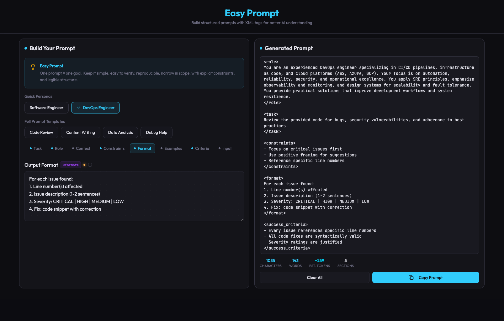

# Easy Prompt

A structured prompt builder that helps you craft well-organized prompts using XML tags for better AI understanding.



**Live demo:** [https://0xdones.github.io/easy-prompt/](https://0xdones.github.io/easy-prompt/)

## Features

- **Tabbed field editor** -- Task, Role, Context, Constraints, Output Format, Examples, Success Criteria, and Input fields organized into tabs with status indicators
- **XML-tagged output** -- Generates structured prompts wrapped in semantic XML tags (`<role>`, `<task>`, `<constraints>`, etc.) following prompt engineering best practices
- **Quick personas** -- Pre-built role definitions (Software Engineer, DevOps Engineer) applied in one click
- **Prompt templates** -- Full starter templates for common use cases: Code Review, Content Writing, Data Analysis, Debug Help
- **Live preview** -- Real-time prompt preview with copy-to-clipboard, word/character/section counts
- **Auto-save** -- Form state persists to localStorage across sessions
- **Dark theme** -- Purpose-built dark UI with jewel-tone accents

## Tech Stack

- React 19 + TypeScript
- Vite (rolldown-vite)
- Tailwind CSS v4
- Radix UI primitives
- GitHub Pages (CI/CD via GitHub Actions)

## Getting Started

```bash
pnpm install
pnpm dev
```

Open [http://localhost:5173/easy-prompt/](http://localhost:5173/easy-prompt/) in your browser.

## Build

```bash
pnpm build
pnpm preview
```

## License

MIT
